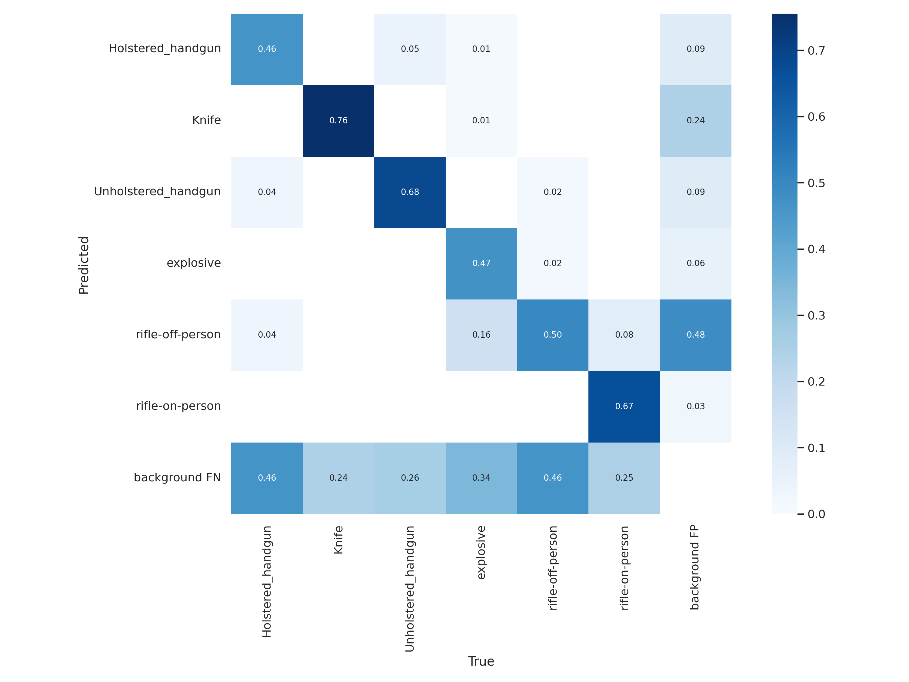

# Weapon Detection

A useful application that detects any imminent weaponry in hopes of security and safety.

As for our website: it was built using a Bootstrap placeholder with HTML and CSS, but to connect with our model, a Python framework called [_Flask._](https://github.com/pallets/flask/ "Flask git repo") Flask allowed us to interface our previously trained model with our website so that users could upload photos to have our model run detection on whatever subjects may be in the user's photo.

#### Note From The Team

```python
userAns = input("is java good? ")
while userAns = "yes" or userAns = "y":
  print("Your opinion is wrong")
  input("Try again. is java good? ")
if userAns == "no" or userAns == "it sucks" or userAns == "  n":
    print("Correct! great Job! you are a human being")
else:
  print("this is not an acceptable answer")
```

## Introduction

We came up with this project after reflecting on the recent crime that has been going on in the US. We created a product that analyzes pictures/videos for dangers/threats (Knives/guns/other weapons) in public areas. Our original goal was to use CCTV footage to detect weapons, with the ability to detect if a person was holding the weapon or not. Ultimately with the three weeks that we had to create this model, we were a little limited on what we could do. The final product is capable of detecting 6 individually different classes from whatever image the user may have input, and recognition of those 6 classes can be a little spotty. For the most part, our accuracy is satisfactory and we do produce positive results.

## Training

The first iteration of training started with a dataset of 940 Images, with a total of 7 classes:

1. Holstered_handgun
2. Unholstered_handgun
3. Explosive
4. Knife_in-hand
5. Knife_out-hand
6. Rifle-off-person
7. rifle-on-person

This dataset was then augmented with flip, blur, and brightness, and ran through the model. There were some problems with this iteration however, knives were constantly being detected as guns due to uneven sorting between the testing, validation, training sets, and other inaccuracies.

The second iteration added an additional 168 images to the data set in order for the classes to be better represented in the dataset and the bounding boxes for the images were readjusted. However, it was having an issue differentiating between knives and rifles, due to all 200 knife images only being in the validation and testing sets and not the training set.

The fourth iteration kept the same amount of images, however, the Knife_in-hand and Knife_out-hand were combined into one class, the Knife class. The images of knives were redistributed between the sets in order for the model to be able to train for knives as well as a noise augmentation was added to the dataset as a whole. With these changes there was a huge improvement in the results of the model, however, there was still a lack of null images within the dataset.

The fifth iteration added an additional 210 images for a total of 1318 images, including more knives and null images. Overall showing a huge improvement in every aspect, however not without its flaws.

The sixth iteration added a hundred images for each class in order to improve accuracy
of the model, showing the best results out of the six.



## Evaluation

#### Accurate Predictions

...

#### Misidentification

Though with respectable accuracy, our model often incorrectly identifies or misidentifies weapons in various pictures, a problem commonly associated with models trained for only 3 weeks. Furthermore, a skew in our dataset, with explosives and rifles-off-person being overrepresented, and knives, rifles-on-person, and holstered handguns being underrepresented in our data, was likely also a contributing factor to our model's letdowns in performance.

## Frontend

The front end of our website displaying the model was created with a bootstrap template found at startbootstrap.com. Furthermore, we used Python framework Flask to connect our website to our model, and add functionality (image upload/processing)

## Conclusion

Our product is good for it being done in three weeks but our team had bigger plans than just detecting things in images. 

As stated in the beginning of our presentation we were planning to use CCTV footage. Our original idea expanded to what could be a full blown product. It was to detect whether a situation was hostile or not. Using live footage and audio detection. It was supposed to be able to tell the difference between a person threatening others with a knife and someone cutting up some steak. We even had an idea were it'd send out alerts whether that be to everyone in the area, the owner, or police. Of course, there's always things that can go wrong.

There were chances of the perpetrator being alerted as well, misidentifications which would lead to falsely calling authorities, and weapons of cops being identified as threats.

In conclusion, there was a lot we got done in three weeks. However, to create the product we envisioned you'd need AI. True artificial intelligence that can understand what we do about a situation- and maybe we can achieve that. It just takes people like us putting our minds together like we did here at AI Camp 2022.

